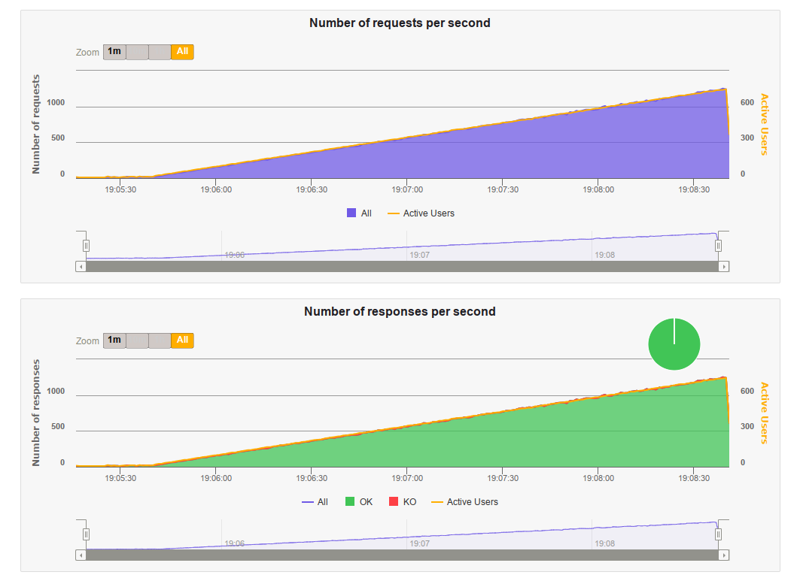

# Rinha de gal... backend

Meu projeto para [rinha de backend 2023 Q3](https://github.com/zanfranceschi/rinha-de-backend-2023-q3) feito em C.

Queria fazer no pêlo mesmo, mas como estava em cima da hora vou fazer com o [facil.io](https://facil.io), uma biblioteca C que traz um web server performante + mini http framework. Special thanks to [boazsegev](https://github.com/boazsegev/facil.io) for the lib!

Lib do próprio postgres para conexão com a db. Sem caching externo, como Redis por exemplo.

# Sumário
- [Rinha de gal... backend](#rinha-de-gal-backend)
- [Sumário](#sumário)
- [Performance](#performance)
- [Funcionamento](#funcionamento)
	- [Web](#web)
		- [Roteamento](#roteamento)
	- [Banco de dados](#banco-de-dados)
	- [.env](#env)
- [Takeaways](#takeaways)
- [Resultados](#resultados)
- [Execução](#execução)
	- [Local](#local)
	- [Docker compose](#docker-compose)
- [Utilização](#utilização)
- [Gatling](#gatling)
- [TODO](#todo)

# Performance

Muito boa aperformance 👍

Abaixo pode-se ver a performance da versão final do sistema. Contagem final: `+-46931` 



Referência rápida da configuração:

* [Nginx](https://www.nginx.com/blog/tuning-nginx/)
  * Workers: 1024 (testado até com 512 sem problemas)
  * epoll
  * Access log off
  * Keepalive
  * Caching
* Postgresql
  * Docker compose health check
  * Campo de busca (`generated` nome, apelido, stack) e indexação com trigrama
* Api
  * Thread pool. Tamanho da pool usada na versão final: `[1]`
  * Connection pool. Tamanho da pool usada na versão final: `[1]`
  * Libs
    * [libpq](https://www.postgresql.org/docs/16/libpq.html): postgresql lib
    * [facil.io](https://facil.io): webserver, http handling, thread pool, json
* Docker compose
  * Network mode como `host` para todos os serviços
* Recursos:

| serviço 		| cpu (cores) 	| memória ram(gb) |
|-				|-				|-|
| api 1 		| 0.1 			| 0.5 gb|
| api 2 		| 0.1 			| 0.5 gb|
| nginx 		| 0.1 			| 0.5 gb|
| postgresql 	| 1.2 			| 1.5 gb|

# Funcionamento

Este projeto foi feito em C utilizando postgres como banco de dados.

## Web

O elemento web foi feito utilizando a biblioteca [facil.io](https://facil.io), que já dá algumas funcionalidades básicas para um webserver http como: http parsing, multi threading, multi process/worker behavior, json parsing. 

Não há rotamento qualquer, só basicamente callbacks pára requisições http e o parsing de json. A biblioteca é bem completa, possui suporte a várias coisas como: websockets, generic protocols, event based I/O, data structures, criptography, cachihng with Redis, várias funcionaldiades completas e ótimas aqui não exploradas mas que vale a pena serem vistas, deixem a estrelinha no repo deles lá!

### Roteamento

Rotemanete foi feito no [main.c](main.c) mesmo: 

```c
// main callback
void on_request(http_s *h){
	if(fiobj_str_cmp(h->method, "GET")){
		on_get(h);
	}
	else if(fiobj_str_cmp(h->method, "POST")){
		on_post(h);
	}
	else{
		h->status = http_status_code_MethodNotAllowed;
		http_send_body(h, "Method not allowed", 18);
	}
}
```

Vê se que temos apena o callback `on_request` e roteamos com base na comparação direto do métodos.

Para as request de GET, temos a verificação direta do path dado ao webserver:

```c
// get
void on_get(http_s *h){
	// printf("value: %s\n", fiobj_obj2cstr(h->query).data);
	
	if(fiobj_str_cmp(h->path, "/contagem-pessoas")){								// count
		on_get_count(h);
	}
	else if(fiobj_str_substr(h->path, "/pessoas")){									// get 

		if(h->query != FIOBJ_INVALID){												// search 
			on_get_search(h);
		}
		else{																		// get by uuid or invalid request
			on_get_uuid(h);
		}
	}
	else{
		h->status = http_status_code_BadRequest;									// search without query
		http_send_body(h, "Bad request", 11);
	}
}
```

E aqui temos o callback para cadastro de pessoa. É bem extenso pois delicadamente pegamos os campos do json, fazemos as verificações e validações, chamamos a db com o modelo e tratamos o resultado retornado pela db.

```c
// post
void on_post(http_s *h){
	if(http_parse_body(h)){
		h->status = http_status_code_BadRequest;								// cadastro sem json
		http_send_body(h, "Bad request", 11);
		return;
	}

	// pegar valores do json
	FIOBJ key = fiobj_str_new("", 1);

	// apelido
	fiobj_str_clear(key);
	fiobj_str_write(key, "apelido", 7);
	char *apelido   	= fiobj_obj2cstr(fiobj_hash_get(h->params, key)).data;

	// nome
	fiobj_str_clear(key);
	fiobj_str_write(key, "nome", 4);
	char *nome      	= fiobj_obj2cstr(fiobj_hash_get(h->params, key)).data;

	// nascimento
	fiobj_str_clear(key);
	fiobj_str_write(key, "nascimento", 10);
	char *nascimento	= fiobj_obj2cstr(fiobj_hash_get(h->params, key)).data;

	// stack
	fiobj_str_clear(key);
	fiobj_str_write(key, "stack", 5);

	FIOBJ stackobj = fiobj_hash_get(h->params, key);
	size_t stacksize;
	db_results_t *res;

	if(
		(stackobj == FIOBJ_INVALID) ||    // stack nao presente
		(FIOBJ_IS_NULL(stackobj)) ||      // presente mas nula
		(fiobj_ary_count(stackobj) == 0)  // stack vazia
	){
		stacksize = 0;
		res = pessoas_insert(db, nome, apelido, nascimento, stacksize, NULL);
	}
	else{																			// stack valida
		stacksize = fiobj_ary_count(stackobj);
		char *stack[stacksize];

		// pegar valores da stack
		for(size_t i = 0; i < stacksize; i++){
			stack[i] = fiobj_obj2cstr(fiobj_ary_index(stackobj, i)).data;
		}

		res = pessoas_insert(db, nome, apelido, nascimento, stacksize, stack);
	}

	// chamada pro banco
	switch(res->code){
		case db_error_code_ok:
		{
			// header Location de retorno
			FIOBJ name = fiobj_str_new("Location", 8);
			FIOBJ value = fiobj_str_new(NULL, 0);
			fiobj_str_printf(value, "/pessoas/%s", db_results_read_string(res, 0, 0));
			http_set_header(h, name, value);

			// retornar uuid  no body 
			FIOBJ json = fiobj_str_new(NULL, 0);
			fiobj_str_printf(json, "{\"id\":\"%s\"}", db_results_read_string(res, 0, 0));
			fio_str_info_s jsonstr = fiobj_obj2cstr(json);
			
			h->status = http_status_code_Created;
			http_send_body(h, jsonstr.data, jsonstr.len);

			fiobj_free(name);
			fiobj_free(json);
		}
		break;

		case db_error_code_invalid_range:
		case db_error_code_invalid_type:
		case db_error_code_unique_constrain_violation:
			h->status = http_status_code_UnprocessableEntity;
			http_send_body(h, res->msg, strlen(res->msg));
			break;

		default:
			h->status = http_status_code_InternalServerError;
			http_send_body(h, res->msg, strlen(res->msg));
			break;
	}

	// free stuff
	fiobj_free(key);
	db_results_destroy(res);
}
```

## Banco de dados

Para comunicação com o postgres utilizei a [biblioteca do postgres](https://www.postgresql.org/docs/16/libpq.html) mesmo.

Para ajudar na abstração e habilitar a criação de uma connection pool, eu mesmo fiz uma layer de abstração genérica para base dados em C, que engloba diferentes tipos de conexão, veja [src/db.c](src/db.c), [src/db.h](src/db.h), [src/db_priv.h](src/db_priv.h) e [src/db_postgres.h](src/db_postgres.h).

Aqui temos um insert de pessoas, [models/pessoas.h](models/pessoas.h), na db utilizando a layer genérica feita:

```c
db_results_t *pessoas_insert(db_t *db, char *nome, char *apelido, char *nascimento, size_t stack_count, char **stack){
	char *query = "insert into pessoas "
	 	"(id, apelido, nome, nascimento, stack) "
	 	"values("
			"gen_random_uuid(),"
			"$1,"
			"$2,"
			"$3,"
			"$4"
		") "
		"returning id";

	return db_exec(db, query, 4, 
		db_param_string(apelido),
		db_param_string(nome),
		db_param_string(nascimento),
		db_param_string_array(stack, stack_count)
	);
}
```

## .env

Temos um util [varenv.h](varenv.h) para carregar arquivos `.env` e settar as váriavéis de ambiente no Linux:

```c
// try load env var from env file
loadEnvVars(NULL);
```

# Takeaways

* Containers docker em modo `network_mode: host` são masi performantes. Ao que tudo indica, a network padrão modo bridge possuí processamente extra sobre ele que afeta o desempenho, enquanto que quando se usa o host não há essa limitação
* Webservers performantes usam uma thread para cada conexão, utilizando uma thread pool como mecanismo para tal 
* Similarmente, queries para banco de dados usam uma conexão para cada thread, utilizando uma connection pool 
* Base de dados gastam bastante cpu e memória se usadas muitas conexões, gargala demais, usar menos conexões se possível
* Desativar logging desnecessário 
* Busca em database é custoso, uma solução é concatenar os termos utilizados na busca, como nome e apelido, em uma coluna gerada pelo banco, e aplicar indexação nela, nesssa implementação foi usado indexação poir trigrama, gist op. Outra solução poderia seria uma full text search 
* O balanço desejado é de os serviços poderem aguetnar as conexões dadas pelo nginx e que a database acompanhe o ritmo das api's. Portanto, quem dita o ritmo de tudo é o balanceador de carga, que vai limitar as conexões repassadas as api's, api's que devem suportar essa carga tendo uma relação aproximada de 1:1 de threads para db connections, sem usar muitas connections para não gastar muita memória e cpu do banco. Nessa inmplementação uma razão de `1024 nginx workers >> 2 api's de 50 threads / connections cada`.

# Resultados

Progresso feito através dos testes, documentando alterações, resultados e descobertas se encontra em [RESULTADOS.md](RESULTADOS.md).

# Execução

Dependencies:
* make
* gcc
* docker
* docker-compose
* java 8

## Local

Compilar projeto em modo release local

```console
$ make release
```

Copiar o `.env.template` para `.env` e colocar sua config.

`.env`:
```ini
SERVER_PORT=5000  	# porta que o servidor vai escutar
SERVER_DB_CONNS=10	# quantidade de conexões simultâneas com o db
SERVER_THREADS=25 	# quantidade de threads a serem usadas para o servidor 
SERVER_WORKERS=5  	# quantidade de processos a serem usado para o servidor
DB_HOST=          	# endereço do db
DB_PORT=          	# porta do db
DB_DATABASE=      	# nome da db
DB_USER=          	# usuário da db
DB_PASSWORD=      	# senha do usuário da db
```

**(Opcional)**: Subir o banco postgres com docker compose:
```console
$ sudo docker-compose up db -d 
```

Para usar a db do compose, configurar o `.env` como:

```ini
DB_HOST=localhost
DB_PORT=5432
DB_DATABASE=capi
DB_USER=capi
DB_PASSWORD=rinhadegalo
```

Executar:

```console
$ ./webserver
```

## Docker compose 

Já configurado para rinha com: [docker-compose.yml](docker-compose.yml).

**Atenção a senha, pois `sudo` será usado por causa do `docker`!**

```console
$ make up
```

* **Utiliza `port=9999`.**

# Utilização

Endpoints conforme definido nas [intruções da rinha](https://github.com/zanfranceschi/rinha-de-backend-2023-q3/blob/main/INSTRUCOES.md#endpoints).

Request insomnia v4 em: [insomnia/Insomnia.json](insomnia/Insomnia.json)

# Gatling

Para realizar o stress test com o gatling, basta executar:

```console
$ make gatling
```

Obs:
* O gatling será instalado em [gatling/gatling/](gatling/gatling/).
* Os dados em [gatling/resources;](gatling/resources) e o cenário scala [gatling/simulations/RinhaBackendSimulation.scala](gatling/simulations/RinhaBackendSimulation.scala) são os mesmos definidos no [repositório da rinha](https://github.com/zanfranceschi/rinha-de-backend-2023-q3/tree/main/stress-test/user-files).
* Resultados estarão em [gatling/results/](gatling/results/).
* Contagem final será salva em `count.txt`.

# TODO

* Usar unix sockets entre nginx e as apis
