# Resultados

# Timeline
- [Resultados](#resultados)
- [Timeline](#timeline)
  - [Teste simulação após: Validação pré branco e alteração docker file](#teste-simulação-após-validação-pré-branco-e-alteração-docker-file)
  - [Teste simulação após: Alteração busca sql](#teste-simulação-após-alteração-busca-sql)
  - [Teste simulação após: compilar api com -O3](#teste-simulação-após-compilar-api-com--o3)
  - [Teste simulação após: aumentar cpu pra db](#teste-simulação-após-aumentar-cpu-pra-db)
  - [Teste simulação após: reverter config docker compose](#teste-simulação-após-reverter-config-docker-compose)
  - [Teste simulação após: reverter config nginx com 50 conns/threads por api + mais cpu pro nginx](#teste-simulação-após-reverter-config-nginx-com-50-connsthreads-por-api--mais-cpu-pro-nginx)
  - [Teste simulação após: alteração nginx com 50 conns/threads por api](#teste-simulação-após-alteração-nginx-com-50-connsthreads-por-api)
  - [Teste simulação após: nginx tuning + aumento de threads e conns + disable loggin na api e nginx](#teste-simulação-após-nginx-tuning--aumento-de-threads-e-conns--disable-loggin-na-api-e-nginx)
    - [50 thread e 50 conns por api](#50-thread-e-50-conns-por-api)
    - [100 thread e 100 conns por api](#100-thread-e-100-conns-por-api)
  - [Teste simulação após implementação de connection pool](#teste-simulação-após-implementação-de-connection-pool)
  - [Primeiro teste com simulação oficial da rinha](#primeiro-teste-com-simulação-oficial-da-rinha)
  - [Primeiro teste 100% sucesso com a primeira versão da simulação da rinha](#primeiro-teste-100-sucesso-com-a-primeira-versão-da-simulação-da-rinha)

## Teste simulação após: Validação pré branco e alteração docker file

Validação de data de nascimento passou batido

Max total teórico de inserts válidos possíveis fica em [+-46575](https://youtu.be/EifK2a_5K_U?si=a4DMre5Gc-zwxmtD&t=1339).

Dockerfile estava copiando muito lixo

`Dockerfile`:
```Dockerfile
FROM archlinux:latest as build

WORKDIR /app

RUN pacman -Sy --noconfirm glibc make gcc postgresql-libs

COPY facil.io/ ./facil.io/
COPY src/ ./src/
COPY models/ ./models/
COPY main.c .
COPY Makefile .

RUN make release

EXPOSE 5000

ENTRYPOINT [ "/app/webserver" ]
```

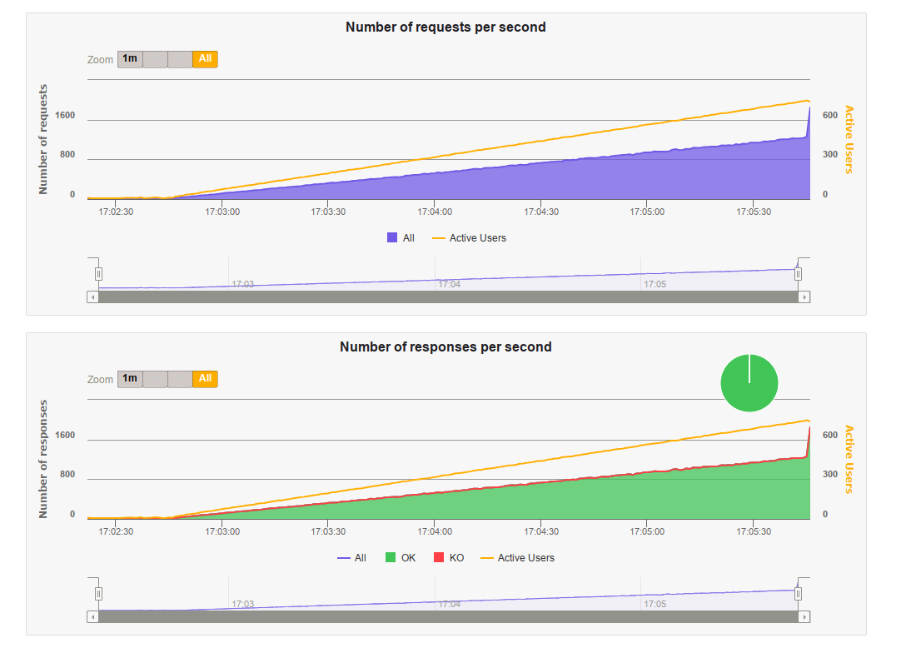

Inserts ficaram em 46913!!!!

## Teste simulação após: Alteração busca sql

Vamos utilizar busca com indexação e trigramas como o vinicius fez no [init.sql](https://github.com/viniciusfonseca/rinha-backend-rust/blob/9a7ef7370fe7f5de071da53feadc12a67c7b5eca/init.sql#L7) dele.

`init.sql`:
```sql
-- immutable function to be used on the 'search' generated column, just a wrapper around 'array to string' to be used on the 'stack' string array
create or replace function immutable_array_to_string(text[], text) 
    returns text as $$ select array_to_string($1, $2); $$ 
language sql immutable;

-- db create
create table pessoas(
	id uuid primary key,
	apelido varchar(32) unique not null,
	nome varchar(100),
	nascimento varchar(10) not null,
	stack varchar(32)[],

	-- search columns, concatenate nome apelido and stack values to index and search later
	search text generated always as ( lower( nome || apelido || immutable_array_to_string(stack, ' ') ) ) stored
);

-- https://about.gitlab.com/blog/2016/03/18/fast-search-using-postgresql-trigram-indexes/
-- loads postgres trigram
create extension pg_trgm;
-- creates index for search using trigram gist
create index concurrently if not exists idx_pessoas_search on pessoas using gist (search gist_trgm_ops(siglen=64));
```

`pessoas.h`:
```c
char *query = "select id, apelido, nome, nascimento, stack "
  "from pessoas "
  "where search like $1 "
  "limit $2;";
```

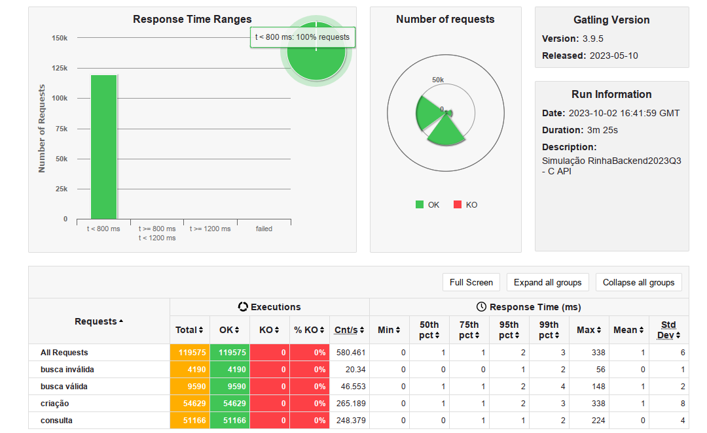

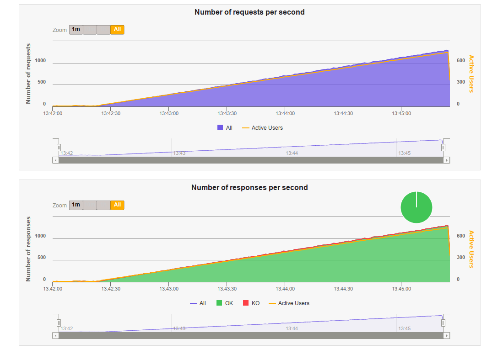

CARALHO!!!!!!!

contagem final: **51166** pessoas

Conlusão: gargalo na busca dessa merda de postgres 

## Teste simulação após: compilar api com -O3

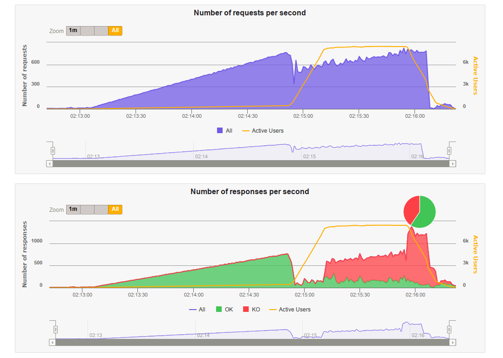

Conclusão: melhor mínima, I'll take it

## Teste simulação após: aumentar cpu pra db

`docker-compose.yml`
```yaml
services:
  nginx:
    deploy:
      resources:
        limits:
          cpus: '0.1'
  api:
    deploy:
      resources:
        limits:
          cpus: '0.1'
  db:
    deploy:
      resources:
        limits:
          cpus: '1.2'
```

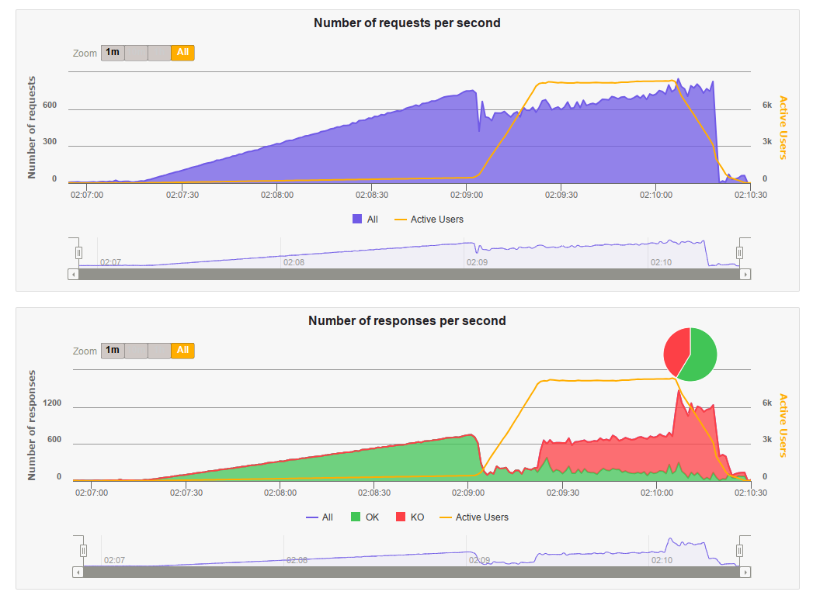

Conclusão: gargalo na db

## Teste simulação após: reverter config docker compose

`docker-compose.yml`
```yaml
services:
  nginx:
    deploy:
      resources:
        limits:
          cpus: '0.15'
  api:
    deploy:
      resources:
        limits:
          cpus: '0.15'
  db:
    deploy:
      resources:
        limits:
          cpus: '1.05'
```

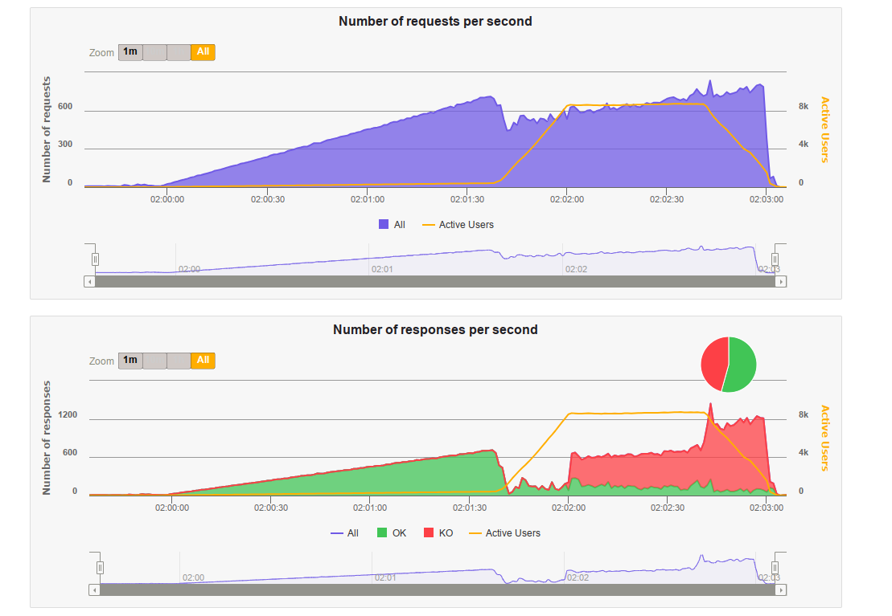

## Teste simulação após: reverter config nginx com 50 conns/threads por api + mais cpu pro nginx

`docker-compose.yml`
```yaml
services:
  nginx:
    deploy:
      resources:
        limits:
          cpus: '0.3'
  api:
    deploy:
      resources:
        limits:
          cpus: '0.15'
  db:
    deploy:
      resources:
        limits:
          cpus: '0.9'
```

`nginx.conf`:
```nginx
worker_processes auto;
worker_rlimit_nofile 500000;

events {
    use epoll;
    worker_connections 1024;
}

http {
    access_log off;
    error_log /dev/null emerg;
    
    upstream api {
        server localhost:5001;
        server localhost:5002;
        keepalive 200;
    }

    server {
        listen 9999;
        location / {
            proxy_buffering off;
            proxy_set_header Connection "";
            proxy_http_version 1.1;
            proxy_set_header Keep-Alive "";
            proxy_set_header Proxy-Connection "keep-alive";
            proxy_pass http://api;
        }
    }
}
```

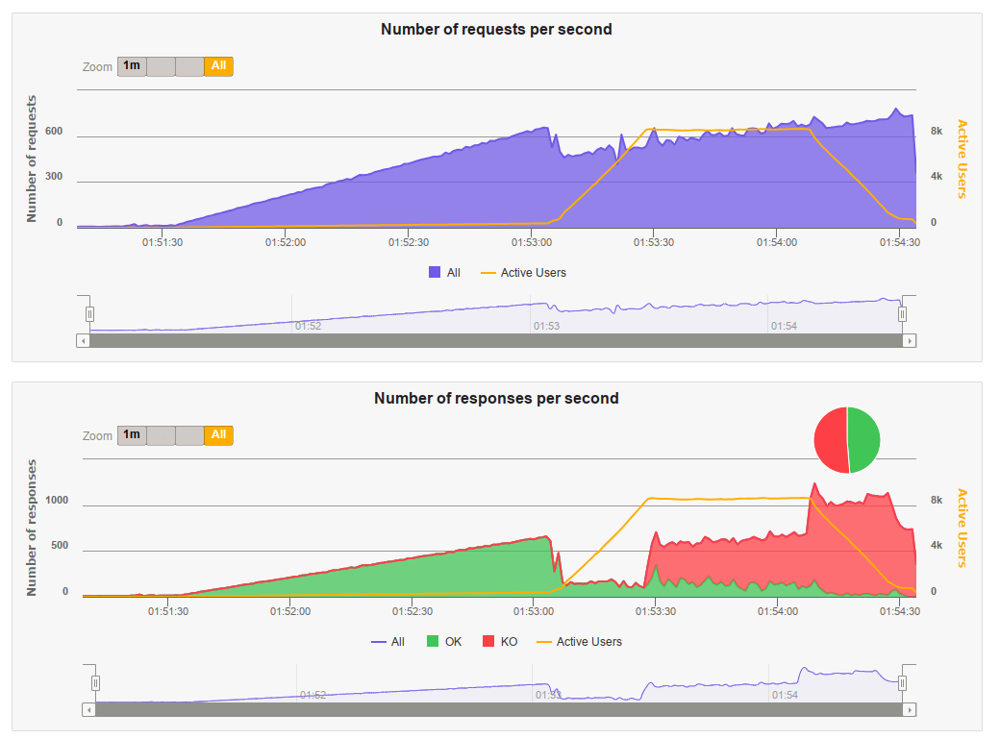

## Teste simulação após: alteração nginx com 50 conns/threads por api

`nginx.conf`:
```nginx
worker_processes auto;
worker_rlimit_nofile 500000;

events {
    use epoll;
    worker_connections 1024;
}

http {
    access_log off;
    
    upstream api {
        server localhost:5001;
        server localhost:5002;
    }

    server {
        listen 9999;
        location / {
            proxy_pass http://api;
        }
    }
}
```

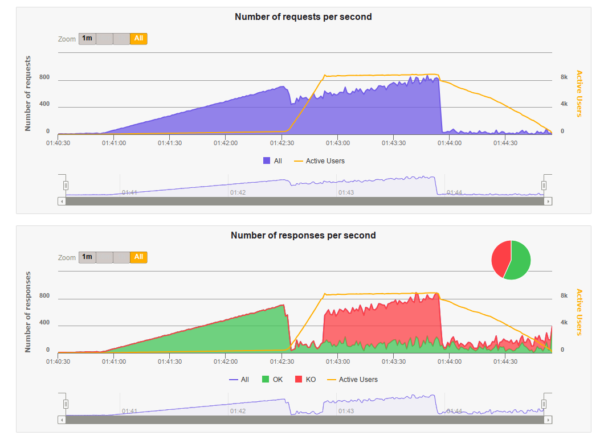

Piorou

Desativado logging da facil.io:

`main.c`:
```c
...
http_listen(port, NULL, .on_request = on_request, .log = false);
...
```

## Teste simulação após: nginx tuning + aumento de threads e conns + disable loggin na api e nginx

* [Nginx tuning](https://www.nginx.com/blog/tuning-nginx/)
* [Vinicius Fonseca nginx.conf](https://github.com/viniciusfonseca/rinha-backend-rust/blob/master/nginx.conf)

`nginx.conf`:
```nginx
worker_processes auto;
worker_rlimit_nofile 500000;

events {
    use epoll;
    worker_connections 1024;
}

http {
    access_log off;
    error_log /dev/null emerg;
    
    upstream api {
        server localhost:5001;
        server localhost:5002;
        keepalive 200;
    }

    server {
        listen 9999;
        location / {
            proxy_buffering off;
            proxy_set_header Connection "";
            proxy_http_version 1.1;
            proxy_set_header Keep-Alive "";
            proxy_set_header Proxy-Connection "keep-alive";
            proxy_pass http://api;
        }
    }
}
```

### 50 thread e 50 conns por api


### 100 thread e 100 conns por api

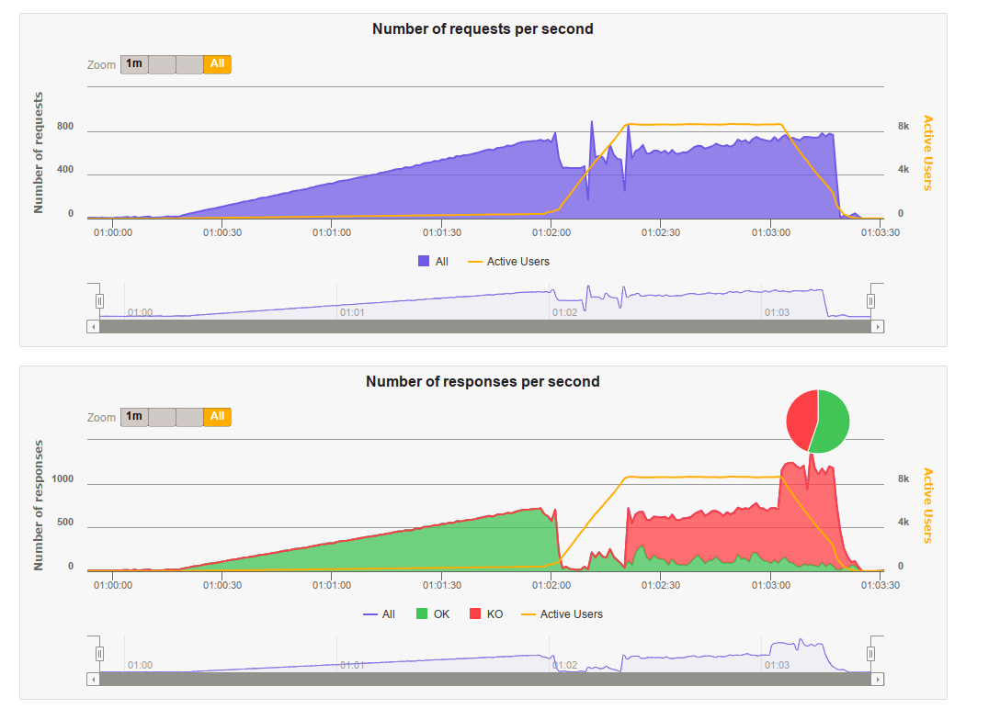

## Teste simulação após implementação de connection pool

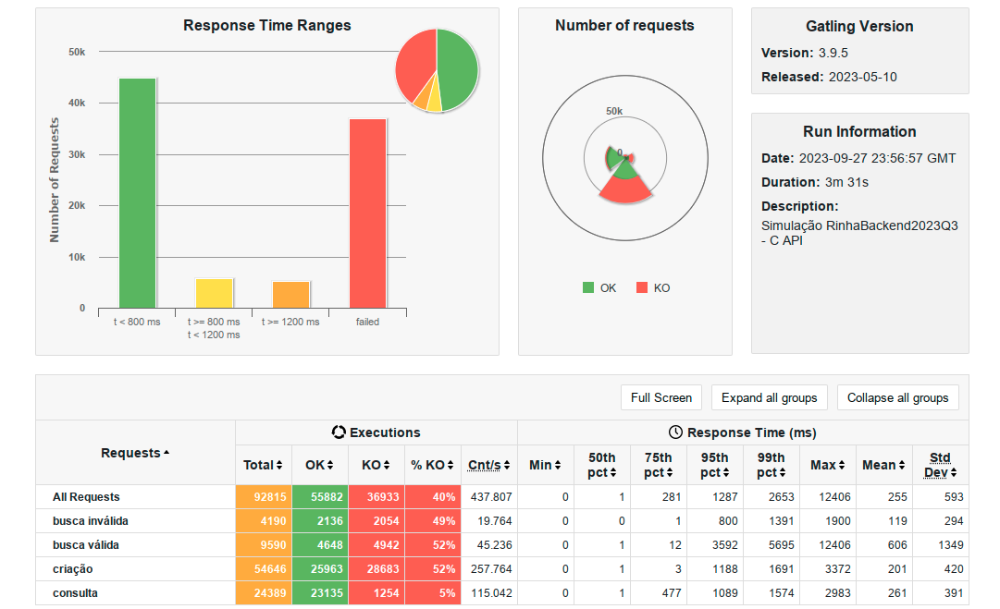

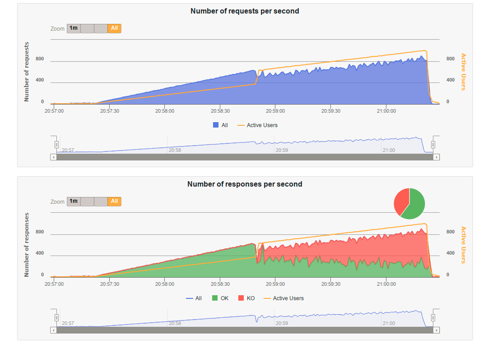

## Primeiro teste com simulação oficial da rinha

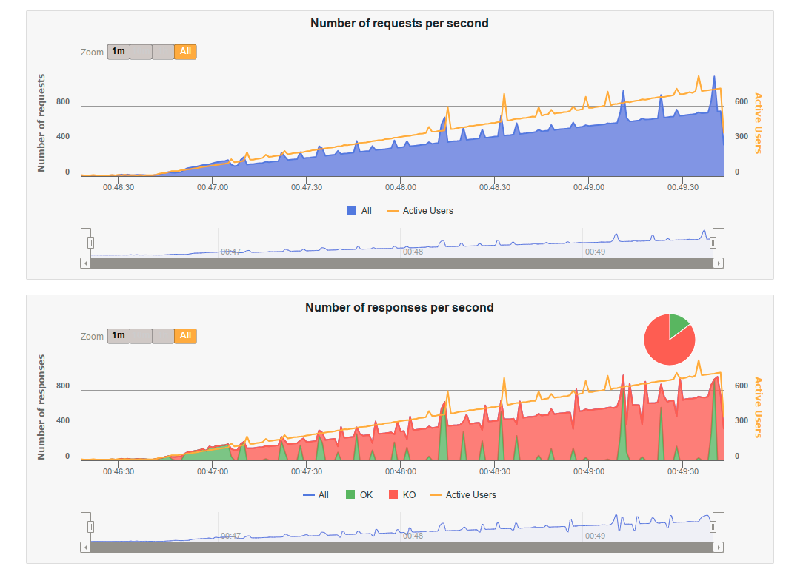

## Primeiro teste 100% sucesso com a [primeira versão da simulação](https://github.com/zanfranceschi/rinha-de-backend-2023-q3/blob/main/teste/gatling/user-files/simulations/rinhabackend/RinhaBackendSimulation.scala) da rinha

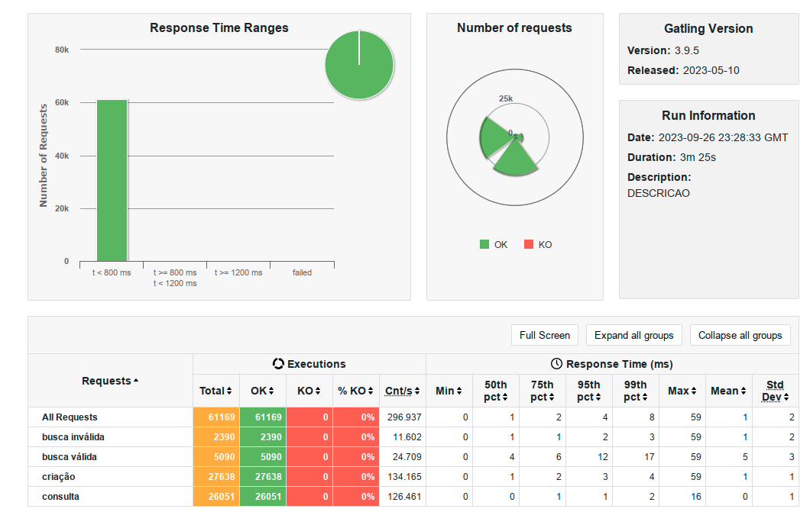