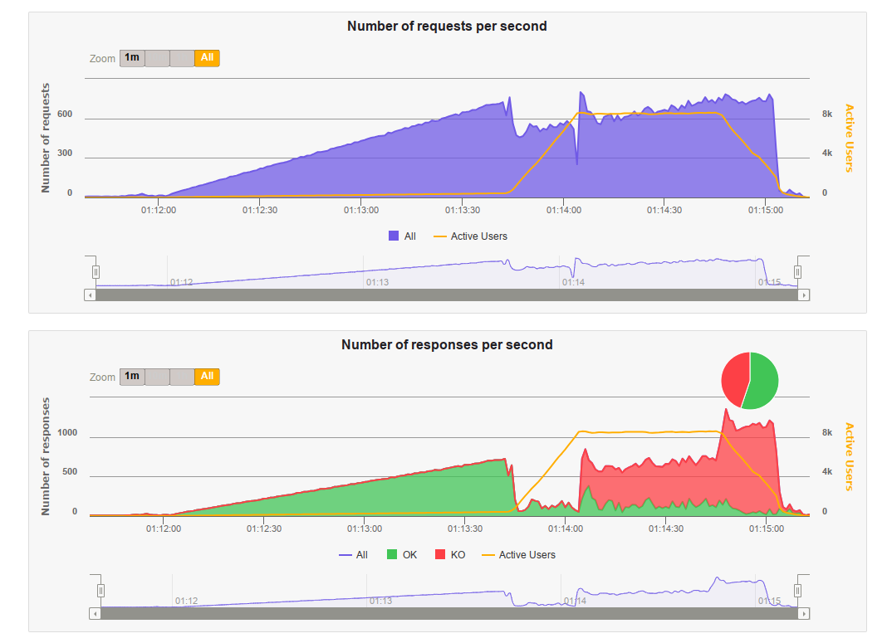

# Resultados

# Timeline
- [Resultados](#resultados)
- [Timeline](#timeline)
	- [Teste simulação após: compilar api com -O3](#teste-simulação-após-compilar-api-com--o3)
	- [Teste simulação após: aumentar cpu pra db](#teste-simulação-após-aumentar-cpu-pra-db)
	- [Teste simulação após: reverter config docker compose](#teste-simulação-após-reverter-config-docker-compose)
	- [Teste simulação após: reverter config nginx com 50 conns/threads por api + mais cpu pro nginx](#teste-simulação-após-reverter-config-nginx-com-50-connsthreads-por-api--mais-cpu-pro-nginx)
	- [Teste simulação após: alteração nginx com 50 conns/threads por api](#teste-simulação-após-alteração-nginx-com-50-connsthreads-por-api)
	- [Teste simulação após: nginx tuning + aumento de threads e conns + disable loggin na api e nginx](#teste-simulação-após-nginx-tuning--aumento-de-threads-e-conns--disable-loggin-na-api-e-nginx)
		- [50 thread e 50 conns por api](#50-thread-e-50-conns-por-api)
		- [100 thread e 100 conns por api](#100-thread-e-100-conns-por-api)
	- [Teste simulação após implementação de connection pool](#teste-simulação-após-implementação-de-connection-pool)
	- [Primeiro teste com simulação oficial da rinha](#primeiro-teste-com-simulação-oficial-da-rinha)
	- [Primeiro teste 100% sucesso com a primeira versão da simulação da rinha](#primeiro-teste-100-sucesso-com-a-primeira-versão-da-simulação-da-rinha)

## Teste simulação após: compilar api com -O3


Conclusão: melhor mínima, I'll take it

## Teste simulação após: aumentar cpu pra db

`docker-compose.yml`
```yaml
services:
  nginx:
    deploy:
      resources:
        limits:
          cpus: '0.1'
  api:
    deploy:
      resources:
        limits:
          cpus: '0.1'
  db:
    deploy:
      resources:
        limits:
          cpus: '1.2'
```


Conclusão: gargalo na db

## Teste simulação após: reverter config docker compose

`docker-compose.yml`
```yaml
services:
  nginx:
    deploy:
      resources:
        limits:
          cpus: '0.15'
  api:
    deploy:
      resources:
        limits:
          cpus: '0.15'
  db:
    deploy:
      resources:
        limits:
          cpus: '1.05'
```


## Teste simulação após: reverter config nginx com 50 conns/threads por api + mais cpu pro nginx

`docker-compose.yml`
```yaml
services:
  nginx:
    deploy:
      resources:
        limits:
          cpus: '0.3'
  api:
    deploy:
      resources:
        limits:
          cpus: '0.15'
  db:
    deploy:
      resources:
        limits:
          cpus: '0.9'
```

`nginx.conf`:
```nginx
worker_processes auto;
worker_rlimit_nofile 500000;

events {
    use epoll;
    worker_connections 1024;
}

http {
    access_log off;
    error_log /dev/null emerg;
    
    upstream api {
        server localhost:5001;
        server localhost:5002;
        keepalive 200;
    }

    server {
        listen 9999;
        location / {
            proxy_buffering off;
            proxy_set_header Connection "";
            proxy_http_version 1.1;
            proxy_set_header Keep-Alive "";
            proxy_set_header Proxy-Connection "keep-alive";
            proxy_pass http://api;
        }
    }
}
```


## Teste simulação após: alteração nginx com 50 conns/threads por api

`nginx.conf`:
```nginx
worker_processes auto;
worker_rlimit_nofile 500000;

events {
    use epoll;
    worker_connections 1024;
}

http {
    access_log off;
    
    upstream api {
        server localhost:5001;
        server localhost:5002;
    }

    server {
        listen 9999;
        location / {
            proxy_pass http://api;
        }
    }
}
```


Piorou

Desativado logging da facil.io:

`main.c`:
```c
...
http_listen(port, NULL, .on_request = on_request, .log = false);
...
```

## Teste simulação após: nginx tuning + aumento de threads e conns + disable loggin na api e nginx

* [Nginx tuning](https://www.nginx.com/blog/tuning-nginx/)
* [Vinicius Fonseca nginx.conf](https://github.com/viniciusfonseca/rinha-backend-rust/blob/master/nginx.conf)

`nginx.conf`:
```nginx
worker_processes auto;
worker_rlimit_nofile 500000;

events {
    use epoll;
    worker_connections 1024;
}

http {
    access_log off;
    error_log /dev/null emerg;
    
    upstream api {
        server localhost:5001;
        server localhost:5002;
        keepalive 200;
    }

    server {
        listen 9999;
        location / {
            proxy_buffering off;
            proxy_set_header Connection "";
            proxy_http_version 1.1;
            proxy_set_header Keep-Alive "";
            proxy_set_header Proxy-Connection "keep-alive";
            proxy_pass http://api;
        }
    }
}
```

### 50 thread e 50 conns por api



### 100 thread e 100 conns por api


## Teste simulação após implementação de connection pool


## Primeiro teste com simulação oficial da rinha


## Primeiro teste 100% sucesso com a [primeira versão da simulação](https://github.com/zanfranceschi/rinha-de-backend-2023-q3/blob/main/teste/gatling/user-files/simulations/rinhabackend/RinhaBackendSimulation.scala) da rinha

